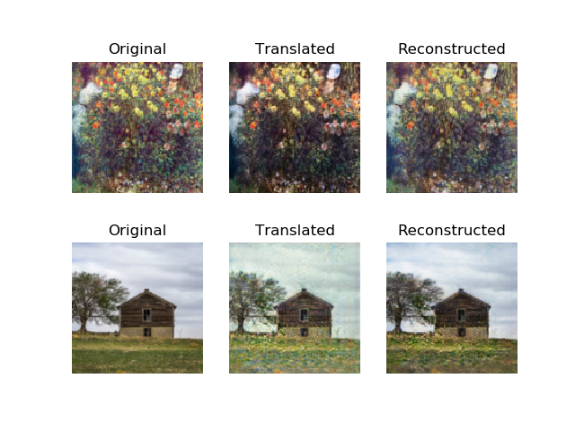
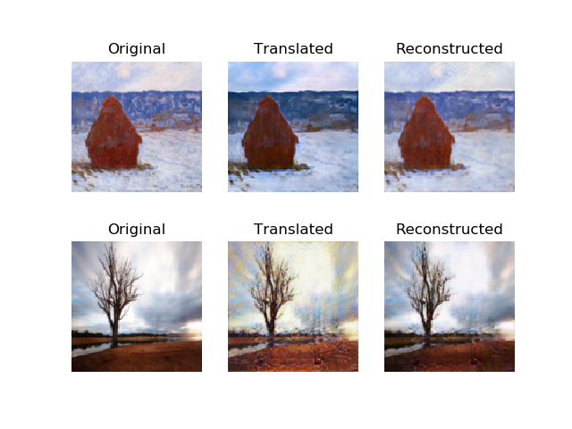
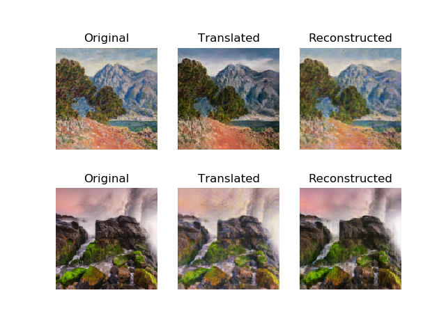
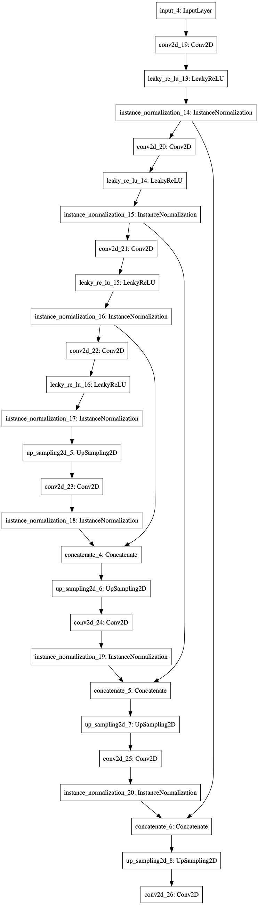
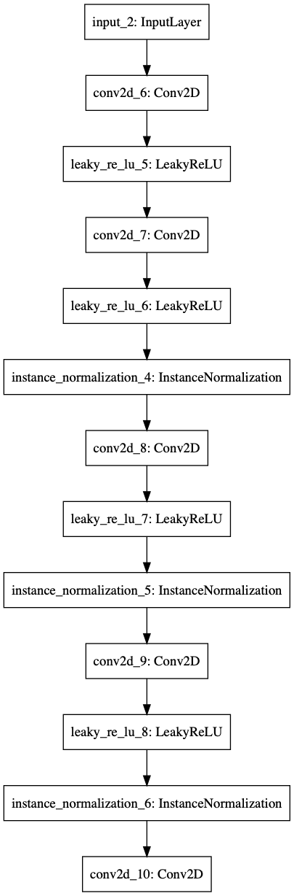

# CycleGAN

## Paper
CycleGAN - [Unpaired Image-to-Image Translation using Cycle-Consistent Adversarial Networks](https://arxiv.org/abs/1703.10593)

## Paper Result

## Net Structure
|Generator|Discriminator|
|---|---|
||
