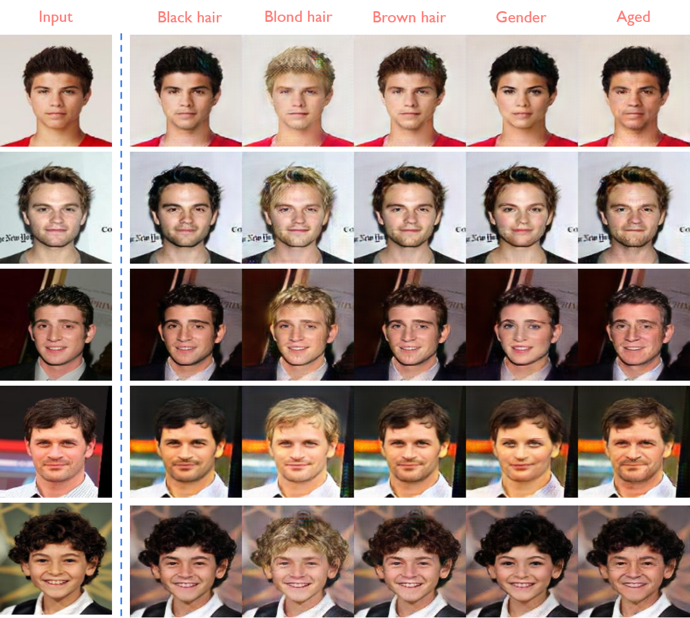
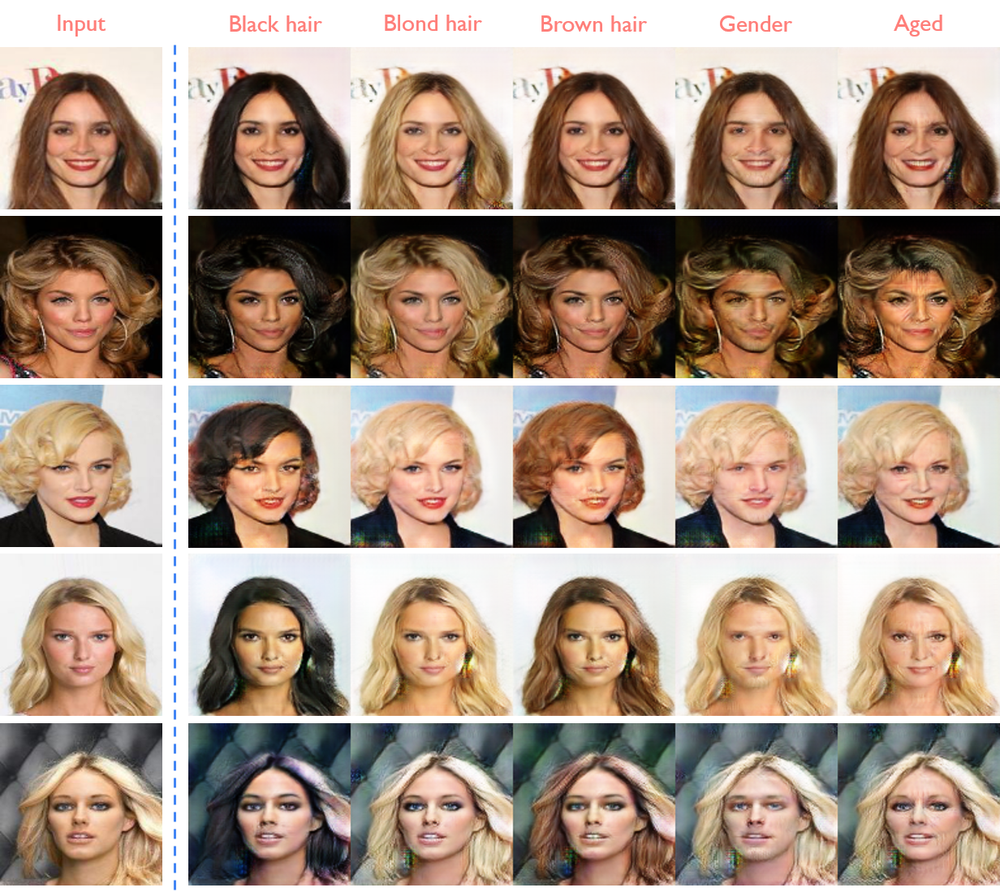

# StarGAN

## Paper
StarGAN - [StarGAN: Unified Generative Adversarial Networks for Multi-Domain Image-to-Image Translation](https://arxiv.org/abs/1711.09020)

## CelebA Result

## Net Structure
|Generator|Discriminator|
|---|---|
||
